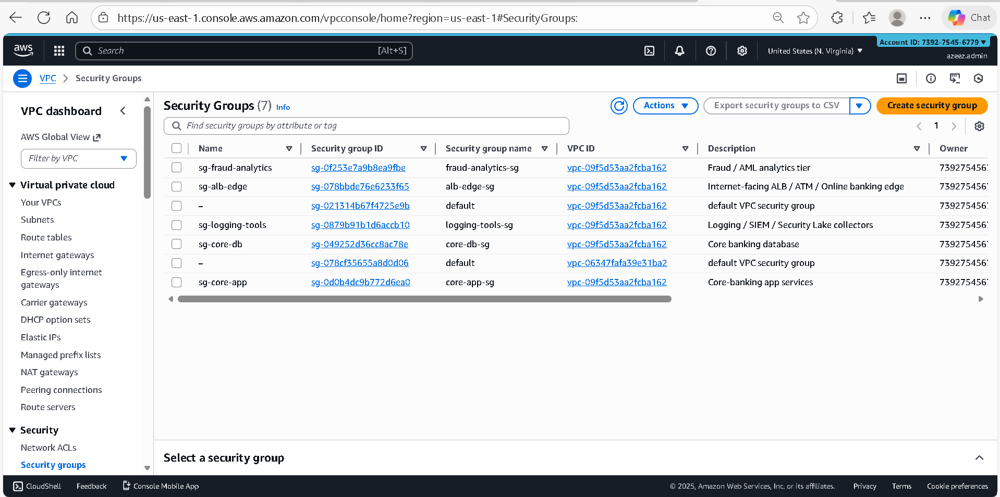
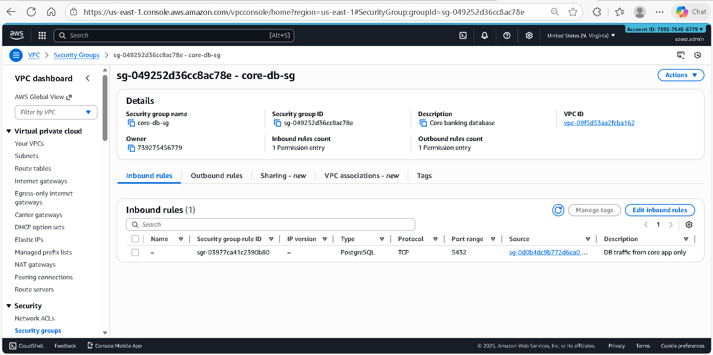

# Week 3 — Network Segmentation & Lateral Movement Prevention Evidence

## Control Objective
Demonstrate Zero-Trust segmentation using AWS Security Groups and NACLs to prevent lateral movement and enforce environment isolation in a Tier-1 financial architecture.

---

## Evidence 1 — Core Database Security Group Exists

**Control:** Dedicated database-tier security group (`sg-core-db`)

**Validation Points:**
- Separate SG for database tier
- Attached only to DB subnets
- No shared SG with application or edge tiers

---

## Evidence 2 — Inbound Access Restricted to Core App Only

**Control:** Least-privilege inbound rule

**Observed Configuration:**
- Protocol: TCP
- Port: 5432 (PostgreSQL)
- Source: `sg-core-app`
- No CIDR-based inbound rules
- No public or cross-tier access

**Security Rationale:**
- Prevents lateral movement
- Eliminates IP-based trust
- Enforces identity-based access (SG → SG)

---

## Evidence 3 — Outbound Traffic Controlled (PCI DSS Best Practice)

**Control:** Restricted database egress

**Observed Configuration:**
- No unrestricted `0.0.0.0/0` outbound rule
- Egress limited to approved internal services only

**Security Rationale:**
- Prevents data exfiltration
- Aligns with PCI DSS 1.3.5
- Meets FFIEC segmentation guidance

---

## Summary of Controls Enforced

| Control Area | Implementation |
|-------------|----------------|
| Lateral movement prevention | SG-to-SG rules only |
| Environment isolation | Separate SG per tier |
| DB exposure | No CIDR-based inbound |
| Exfiltration risk | Restricted outbound rules |
| Audit readiness | Evidence captured in Git |

---

## Policy Enforcement Evidence (Conftest + OPA)

Conftest was executed against the Terraform plan (`tfplan.json`) using OPA policies.

Intentional non-compliant resources were introduced to validate policy enforcement:
- S3 bucket without KMS-based server-side encryption
- S3 bucket missing Public Access Block configuration

Evidence:
- `week3-conftest-fail.txt`
- Screenshots in `images/` (wk3-conftest-fail.png)

This confirms enforcement of encryption and public access controls at plan time.

---

## Technical Summary

> “In my Zero-Trust AWS architecture, the database tier is fully isolated using identity-based Security Group rules. The core database only accepts PostgreSQL traffic from the core application security group, with no CIDR-based access. Outbound traffic is explicitly restricted to prevent data exfiltration, aligning with PCI DSS and FFIEC expectations. All controls are enforced via Terraform and validated with SOC-ready evidence.”

